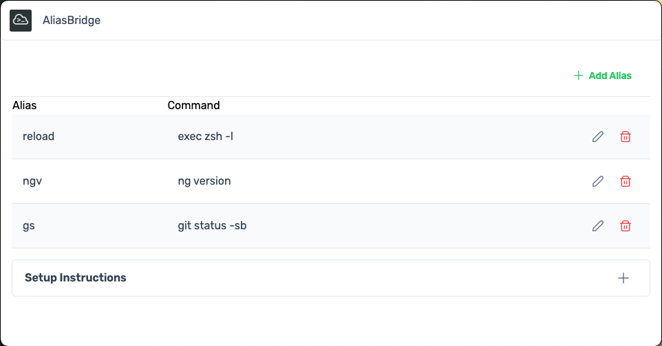

# AliasBridge

<p align="center">
  
</p>

A simple, cross-platform desktop application to easily manage your command-line terminal aliases. Stop editing hidden config files and keep your shortcuts organized!

## The Problem

Managing terminal aliases across different shells (`bash`, `zsh`) and operating systems (macOS, Windows/WSL, Linux) often involves manually editing hidden configuration files like `.zshrc` or `.bashrc`. It's easy to forget complex commands, lose track of why an alias was created, or struggle to keep aliases synchronized between multiple machines.

## The Solution: AliasBridge

AliasBridge provides an intuitive Graphical User Interface (GUI) to:

*   **View** all your managed aliases in one place.
*   **Add** new aliases quickly with a name and command.
*   **Edit** existing aliases.
*   **Delete** aliases you no longer need.
*   **Comment** on aliases to remember their purpose and usage.

It stores your aliases robustly in a local JSON file and automatically generates the necessary shell source file, simplifying your workflow significantly.

## ✨ Core Features (Current)

*   **GUI Management:** Clean interface for viewing, adding, editing, and deleting aliases.
*   **Comments:** Add descriptions to remember what each alias does.
*   **Cross-Platform:** Works on macOS, Windows (via Git Bash/WSL), and Linux.
*   **Robust Storage:** Uses a local JSON file (`~/.alias_bridge_data.json`) as the source of truth.
*   **Automatic Shell File Generation:** Creates/updates a shell source file (`~/.alias_bridge_aliases.sh`).
*   **UUID Identification:** Uses unique IDs internally for reliable alias management.
*   **OS-Specific Setup Instructions:** Guides users on the one-time shell setup.

## 🖥️ Supported Platforms

*   **macOS:** Fully supported (tested with Zsh and Bash).
*   ~~**Windows:** Supported via **Git Bash** or **Windows Subsystem for Linux (WSL)** environments (generates a `.sh` file compatible with these). Direct PowerShell/CMD support is not currently implemented.~~
*   ~~**Linux:** Fully supported (tested with Bash and Zsh).~~

## 🚀 Getting Started (For Users)

1.  **Download:** Grab the latest release for your operating system from the **[Releases Page](https://github.com/YOUR_GITHUB_USERNAME/alias-bridge/releases)**. (Replace with your actual link!)
2.  **Install:**
    *   **macOS:** Open the `.dmg` file and drag `AliasBridge.app` to your Applications folder.
    *   ~~**Windows:** Run the `Setup .exe` installer.~~ **<-- COMING SOON -->**
    *   ~~**Linux:** Make the `.AppImage` file executable (`chmod +x AliasBridge*.AppImage`) and run it. Or install the `.deb`/`.rpm` package.~~ **<-- Coming Soon -->**
3.  **One-Time Shell Setup (CRUCIAL):** You need to tell your terminal shell to load the aliases managed by AliasBridge. Add the following lines **to the end** of your shell's configuration file:

    *   **macOS (Zsh - Default):** Edit `~/.zshrc`
    *   **macOS (Bash):** Edit `~/.bash_profile` or `~/.bashrc`
    *   ~~**Linux (Bash):** Edit `~/.bashrc`~~
    *   ~~**Linux (Zsh):** Edit `~/.zshrc`~~
    *   ~~**Windows (Git Bash):** Edit `~/.bashrc` (usually `C:\Users\YourUsername\.bashrc`)~~

    ```bash
    # Load AliasBridge Aliases
    if [ -f ~/.alias_bridge_aliases.sh ]; then
      source ~/.alias_bridge_aliases.sh
    fi
    ```

    *   **Windows (WSL - e.g., Ubuntu):** Edit `~/.bashrc` or `~/.zshrc` *inside your WSL environment*. **Replace `YourWindowsUsername`** with your actual Windows username:

    ```bash
    # Load AliasBridge Aliases from Windows Home Directory
    # Replace 'YourWindowsUsername' with your actual Windows username
    WINDOWS_ALIAS_FILE="/mnt/c/Users/YourWindowsUsername/.alias_bridge_aliases.sh"
    if [ -f "$WINDOWS_ALIAS_FILE" ]; then
      source "$WINDOWS_ALIAS_FILE"
    fi
    ```

4.  **Restart Terminal:** Open a **completely new** terminal window/tab for the changes to take effect.
5.  **Run AliasBridge:** Launch the application and start managing your aliases!
